How To Make Black & White Photos Look More Natural?
====
We tried to implement a [Github Project](https://github.com/emilwallner/Coloring-greyscale-images-in-Keras) in a different way

To make it run faster on CPU, we redesigned the model:
  
Input is black & white photo, output is colorized photo, there are 20 train samples in total

Following is the result we obtained:
<table>
<tr><th>input</th><th>output</th></tr>	
<tr><td>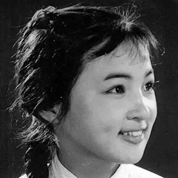</td>
<td>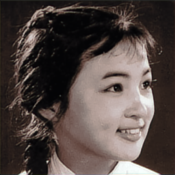</td></tr>
<tr><td>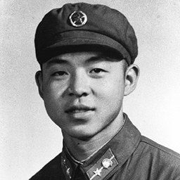</td>
<td>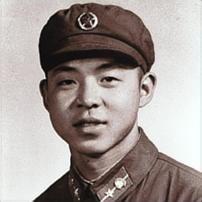</td></tr>
<tr><td>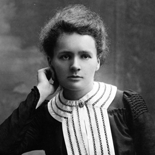</td>
<td>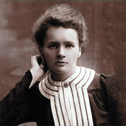</td></tr>
<tr><td>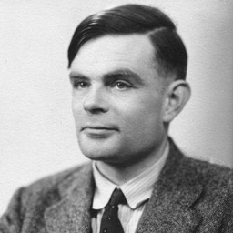</td>
<td>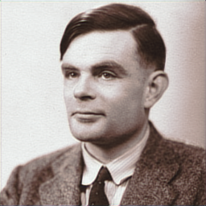</td></tr>

<tr><td></td>
<td>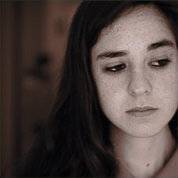</td></tr>
<tr><td></td>
<td>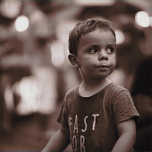</td></tr>
<tr><td></td>
<td>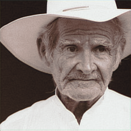</td></tr>
<tr><td></td>
<td>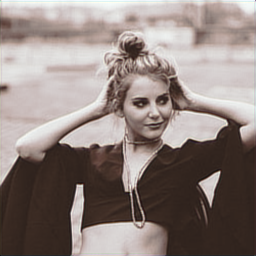</td></tr>
</table>

Reference
----
* [https://medium.freecodecamp.org/colorize-b-w-photos-with-a-100-line-neural-network-53d9b4449f8d](https://medium.freecodecamp.org/colorize-b-w-photos-with-a-100-line-neural-network-53d9b4449f8d)
* [https://github.com/phillipi/pix2pix](https://github.com/phillipi/pix2pix)

[Github Link](https://github.com/microic/niy/tree/master/examples/colorizing_photos)