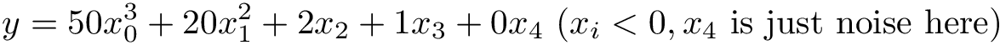
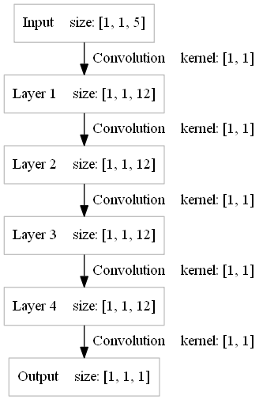
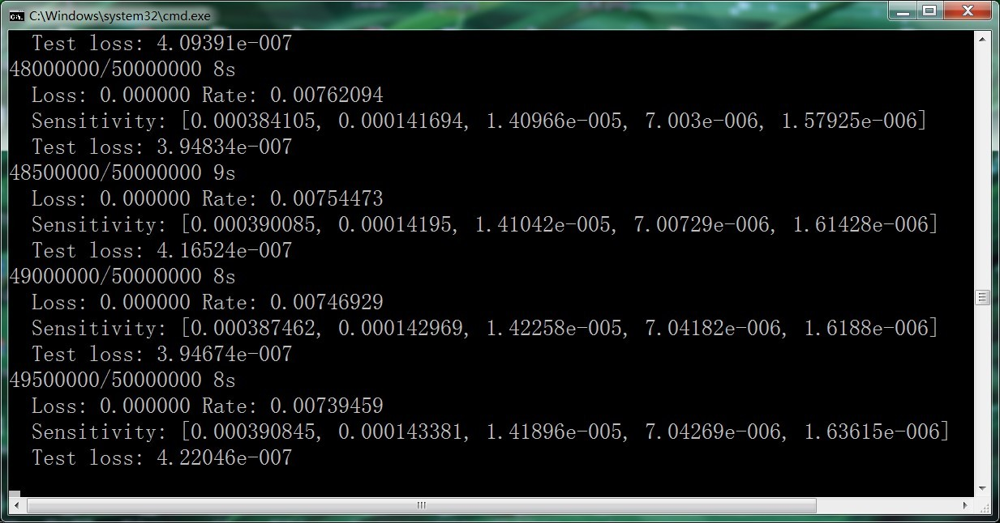

Sensitivity Analysis(Feature Importance Analysis) Using Artificial Neural Network
====
Sensitivity analysis is widely used in disease detection, gas composition analysis, financial analysis... For example, doctors want to know the relationship between a certain disease to multiple variables(body temperature, erythrocyte concentration, blood pH, blood pressure...)

For a MIMO(multiple input, multiple output) nonlinear system, using ANN to do sensitivity analysis is very easy

In this example, we use the following function to generate samples:
  
And the python code for randomly generating 50000 samples is:
<pre>
X = np.random.rand(50000, 5).astype("float32")
Y = 50*(X[:,0]**3) + 20*(X[:,1]**2) + 2*X[:,2] + 1*X[:,3] + 0*X[:,4]
</pre>

The model of ANN can be defined as follow:
  
Run this model, you will get the following result:
  

We can see that the sensitivity for x2 is about twice as x3 and the sensitivity for x4(noise) is nearly zero, the result is in line with expectations

[Github Link](https://github.com/microic/niy/tree/master/examples/sensitivity_analysis)
